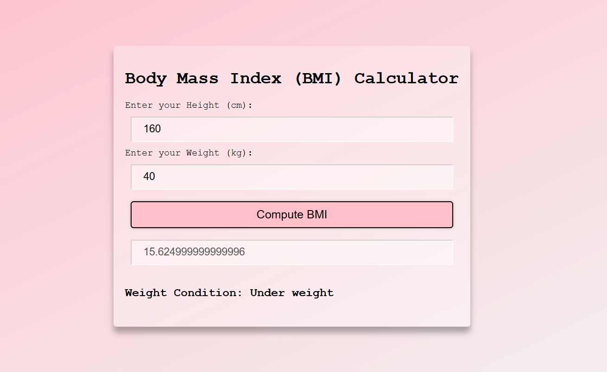
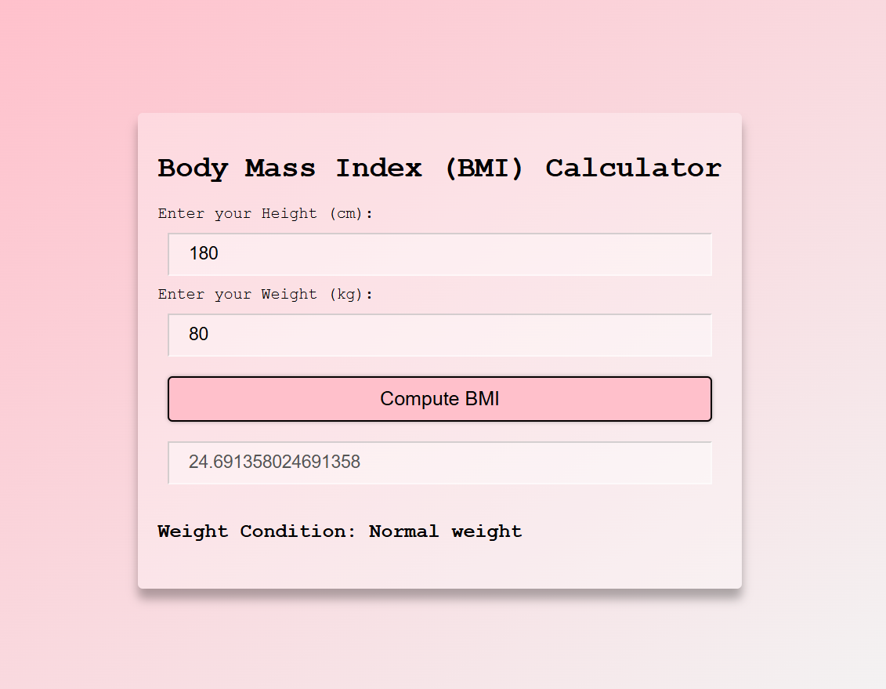
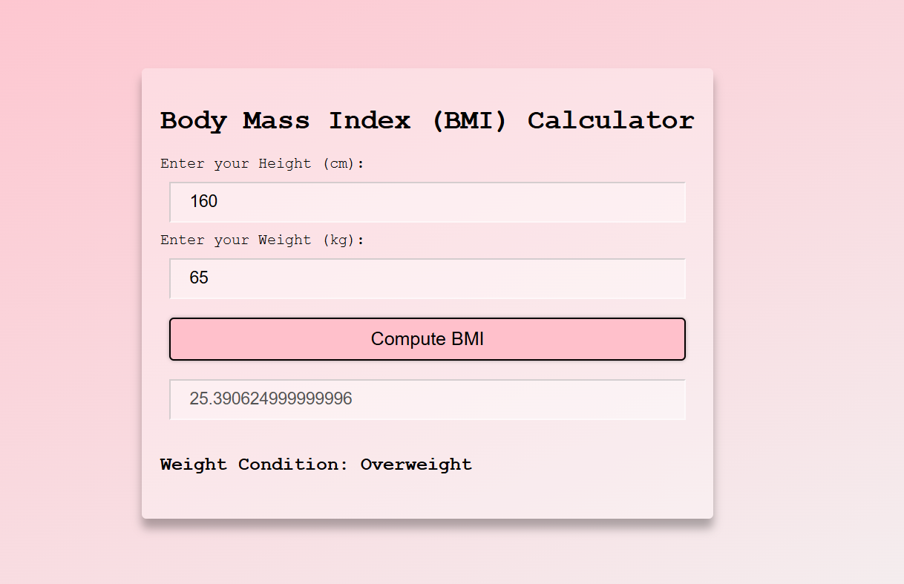
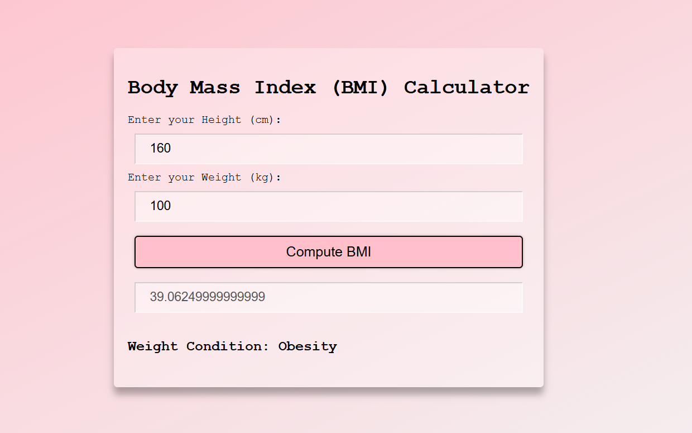

# BMI Calculator

A simple, responsive Body Mass Index (BMI) calculator built using **HTML**, **CSS**, and **JavaScript**. This project marks my first complete Git workflow — from local setup to GitHub push!

## Features:
- Inputs fields for weight(in kg) and height(in cm)
- calculates BMI instantly on the click of a button
- displays BMI category (Under weight, Normal weight, Over weight, Obesity)
- Clean, responsive UI

## Technologies Used:
- `HTML5`
- `CSS3`
- `Javasript`

## File Structure
last_time/
├── `index.html`
├── `style.css`
├── `script.js`
└── `README.md`

## Screenshots

## My Learnings
- Git basics and remote setup 
- Markdown formatting 
- DOM manipulation in JS 
- Styling with CSS

## PS: This is my first fully working GitHub push using proper Git commands:)
- git init
- git remote add origin
- git branch -M main
- git add .
- git commit -m "commit message"
- git push -u origin main